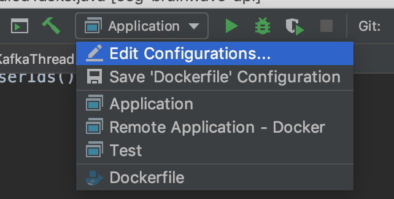

# Homer Controller - EEG API (classifier)

This app enables storing and classifying `eeg` data coming from the [eeg-brainwave-client](https://github.com/HomeIoTController/eeg-brainwave-client). This API will consume a `Kafka` queue containing brainwave readings, and it will store, classify this data and push it back to the Queue.

## Getting Started

* To run this controller just follow the steps on [compose](https://github.com/HomeIoTController/compose)

## Debugging

* To Debug this API you will need to:
  * Run [compose](https://github.com/HomeIoTController/compose)
  * Turn off the `eeg-brainwave-controller` service
    * `docker-compose stop eeg-brainwave-controller`
  * Run the following command:
    * `sudo echo "127.0.0.1       kafka-server" >> /etc/hosts`
  * Open this project with IntelliJ
    * 
    * Select `Remote Application - Docker` and click `Run`

  * This will connect you directly to the Docker container at port `8081`. For more informations check the `docker-compose.yml` at [compose](https://github.com/HomeIoTController/compose)
